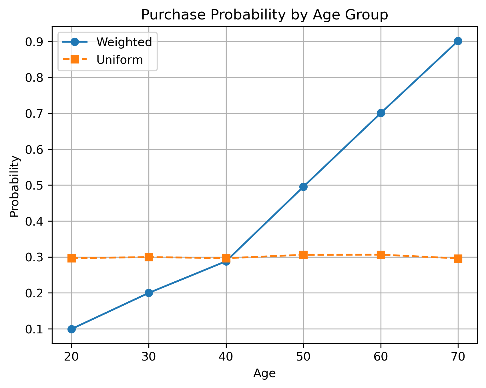

# Age-Based Purchase Simulation

This project simulates purchase behavior across different age groups using two probabilistic models: a weighted probability model and a uniform probability model.

## 📌 Objective

To visualize and compare how weighted vs uniform probability distributions affect purchasing behavior, using simulated data grouped by age.

## 🛠️ Tools & Libraries

- Python 3.x
- Pandas
- NumPy
- Seaborn
- Matplotlib
- Jupyter Notebook

## 🔍 Methodology

1. **Simulated Dataset** of 40,000 users, categorized into age groups (20, 30, ..., 70)
2. **Weighted Model**: Each age group is assigned a purchase probability (e.g., 70-year-olds have 90%)
3. **Uniform Model**: All users have the same purchase probability equal to the weighted average
4. **Visualization**: Line graph comparing actual probabilities between models

## 📈 Results

- Older age groups showed significantly higher purchase rates in the weighted model
- The uniform model flattens out the variation between age groups
- Graph clearly shows divergence between assumptions

## 📁 Output Files

- `Project_Analysis.ipynb`: Main notebook with code and plots
- `Conditional_Probability_Graph.png`: Graph comparing both models
- `Report.txt`: 200-word results summary (won't be uploaded here)

## ✅ Key Insight

Using a uniform distribution can oversimplify customer behavior. Weighted models more accurately reflect real-world differences across demographics. Detailed analysis will be found in the expected report.

## 💡 Future Ideas

- Add gender/income factors
- Fit logistic regression models
- Create an interactive Streamlit dashboard

